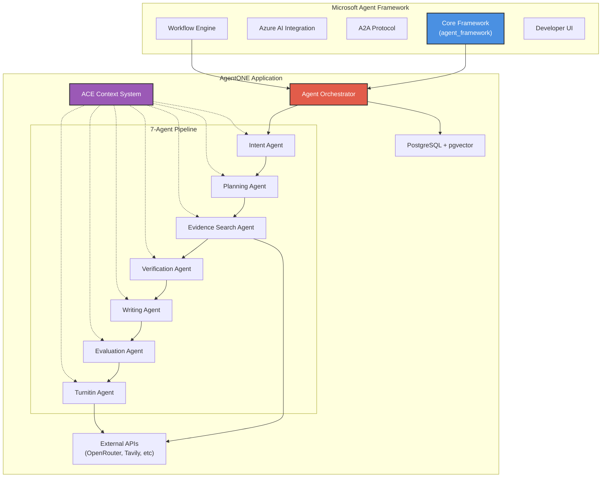
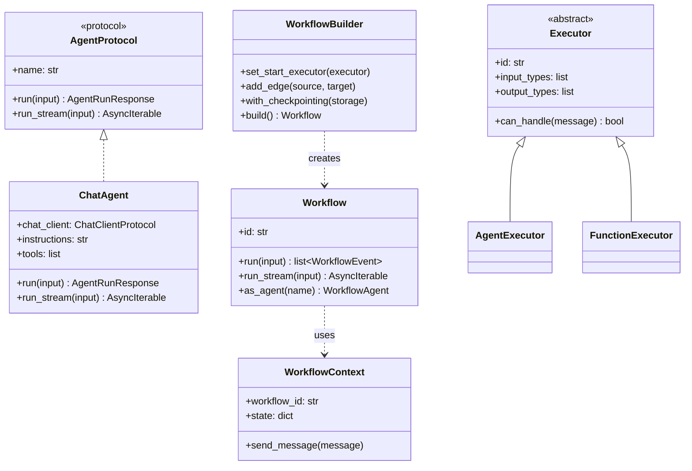
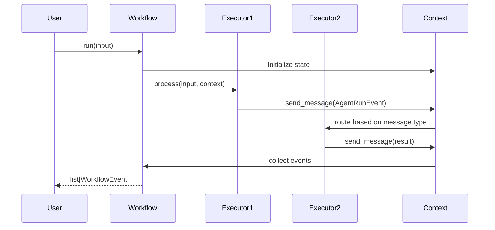
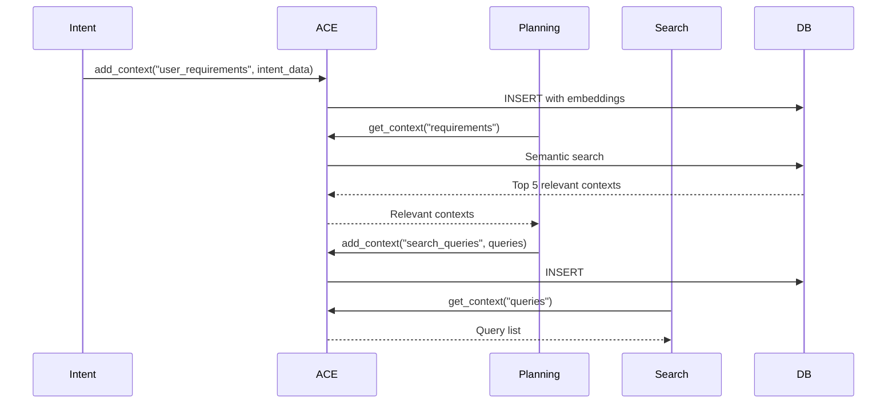
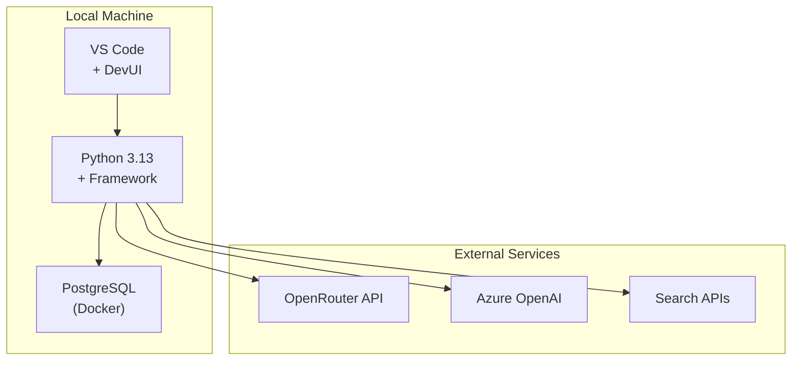
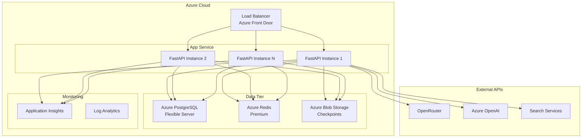

# System Architecture - Microsoft Agent Framework & AgentONE

> **Last Updated**: January 15, 2025  
> **Status**: Production  
> **Audience**: Architects, Senior Engineers, Technical Leads

---

## Table of Contents

1. [Executive Overview](#executive-overview)
2. [System Components](#system-components)
3. [Architecture Layers](#architecture-layers)
4. [Framework Architecture](#framework-architecture)
5. [AgentONE Application Architecture](#agentone-application-architecture)
6. [Data Flow & Communication Patterns](#data-flow--communication-patterns)
7. [Deployment Architecture](#deployment-architecture)
8. [Security Architecture](#security-architecture)
9. [Scalability & Performance](#scalability--performance)

---

## Executive Overview

This repository contains **two major systems** that work together:

### 1. **Microsoft Agent Framework** (Core Infrastructure)
A production-grade, multi-language (.NET + Python) framework for building AI agents and multi-agent workflows.

**Key Capabilities:**
- 🔄 Graph-based workflow orchestration with streaming
- 🎯 Multi-agent patterns: Sequential, Concurrent, Magentic
- 💾 Built-in checkpointing and state management
- 📊 OpenTelemetry integration for observability
- 🔌 Plugin ecosystem (Native functions, OpenAPI, MCP)
- 🌐 A2A (Agent-to-Agent) protocol for distributed systems
- 🎨 DevUI for interactive development

### 2. **AgentONE** (Production Application)
An autonomous research platform built **on top** of the Agent Framework, featuring a 7-agent orchestration pipeline for academic research with real-time feedback and quality assurance.

**Key Features:**
- 📚 7-stage autonomous research pipeline
- 🤖 Multi-model AI strategy (GPT-5, Claude 4.5, Gemini 2.5)
- 🔍 Multi-API search aggregation (Tavily, Exa, Perplexity, Semantic Scholar)
- ✅ Quality gates between agent stages
- 🔄 Real-time WebSocket feedback
- 🎓 Turnitin integration for plagiarism checking
- 💾 PostgreSQL + pgvector for persistence

---

## System Components



---

## Architecture Layers

### Layer 1: Framework Core (Python/C#)

**Location**: `python/packages/`, `dotnet/src/`

**Responsibilities:**
- Agent protocol definitions and implementations
- Chat client abstractions (OpenAI, Azure AI, Copilot Studio)
- Workflow builder and execution engine
- Context management and state persistence
- Message routing and event handling
- Tool invocation and function calling

**Key Classes/Protocols:**
- `AgentProtocol` - Base protocol for all agents
- `ChatAgent` - Concrete agent implementation
- `WorkflowBuilder` - Fluent API for workflow construction
- `Executor` - Base class for workflow nodes
- `WorkflowContext` - State container for workflows

### Layer 2: Orchestration & Patterns (Framework-level)

**Location**: `python/packages/core/agent_framework/_workflows/`

**Patterns Implemented:**
```python
# Sequential Pattern
workflow = (
    SequentialBuilder()
    .add_agent(agent1)
    .add_agent(agent2)
    .add_agent(agent3)
    .build()
)

# Concurrent Pattern
workflow = (
    ConcurrentBuilder()
    .add_agents([agent1, agent2, agent3])
    .with_aggregator(custom_aggregator)
    .build()
)

# Magentic Pattern (Dynamic Multi-Agent)
workflow = (
    MagenticBuilder()
    .add_participant(agent1)
    .add_participant(agent2)
    .add_participant(agent3)
    .with_manager(orchestrator_agent)
    .build()
)
```

### Layer 3: Application Logic (AgentONE)

**Location**: `agentic_layer/`, `python/prowzi/`

**Responsibilities:**
- 7-agent sequential pipeline execution
- ACE (Agentic Context Engineering) shared knowledge
- Real-time WebSocket event emission
- Database persistence (AsyncSession)
- Cost and performance tracking
- Error recovery with exponential backoff

**Sequential Orchestration Pattern:**
```python
class ProwziOrchestrator:
    """Master controller for 7-agent research pipeline"""
    
    async def run_research(self, prompt: str) -> ProwziOrchestrationResult:
        # Stage 1: Intent Analysis
        intent = await self.intent_agent.analyze(prompt)
        await self.emit_event("intent_completed", intent)
        
        # Stage 2: Planning
        plan = await self.planning_agent.create_plan(intent)
        await self.emit_event("planning_completed", plan)
        
        # Stage 3: Evidence Search
        search_results = await self.search_agent.search(plan.queries)
        await self.emit_event("search_completed", search_results)
        
        # Stage 4: Verification (Quality Gate)
        verified = await self.verification_agent.verify(search_results)
        if not verified.quality_score > 0.7:
            # Retry or fail
            pass
        
        # Stage 5: Writing
        draft = await self.writing_agent.write(verified.evidence)
        await self.emit_event("writing_completed", draft)
        
        # Stage 6: Evaluation
        evaluation = await self.evaluation_agent.evaluate(draft)
        await self.emit_event("evaluation_completed", evaluation)
        
        # Stage 7: Turnitin Check
        turnitin = await self.turnitin_agent.check(draft)
        await self.emit_event("turnitin_completed", turnitin)
        
        return ProwziOrchestrationResult(...)
```

### Layer 4: Integration & External Services

**Services Integrated:**

| Service | Purpose | Authentication |
|---------|---------|----------------|
| OpenRouter | Multi-model AI access (20+ models) | API Key |
| Azure OpenAI | Primary GPT models | Azure CLI / API Key |
| Tavily | Web search API | API Key |
| Exa | Neural search | API Key |
| Perplexity | Research-focused search | API Key |
| Semantic Scholar | Academic papers | Public API |
| Browserbase/Stagehand | Browser automation | API Key |
| Turnitin | Plagiarism detection | OAuth 2.0 |
| PostgreSQL | Data persistence | Connection string |
| Redis | Caching & sessions | Connection string |

---

## Framework Architecture

### Core Components



### Workflow Execution Model

**Event-Driven Architecture:**

1. **Input arrives** → Workflow starts with `StartExecutor`
2. **Executor processes** → Emits events (`AgentRunEvent`, `AgentRunUpdateEvent`)
3. **Edge routing** → Context determines next executor based on message types
4. **State management** → `WorkflowContext` maintains shared state
5. **Output collection** → Events accumulate in result stream
6. **Checkpointing** → Optional save points for recovery

**Execution Flow:**


### Checkpointing System

**Location**: `python/packages/core/agent_framework/_workflows/_checkpoint.py`

```python
# Protocol Definition
class CheckpointStorage(Protocol):
    async def save(self, checkpoint_id: str, data: dict) -> None: ...
    async def load(self, checkpoint_id: str) -> dict: ...
    async def list(self) -> list[str]: ...
    async def delete(self, checkpoint_id: str) -> None: ...

# Implementations
- InMemoryCheckpointStorage (for development)
- FileCheckpointStorage (for production)
```

**Usage Pattern:**
```python
workflow = (
    WorkflowBuilder()
    .add_edge(agent1, agent2)
    .with_checkpointing(FileCheckpointStorage("./checkpoints"))
    .build()
)

# Run with auto-checkpointing
events = await workflow.run(input)

# Resume from checkpoint
checkpoint_id = "abc123"
events = await workflow.run_stream_from_checkpoint(checkpoint_id)
```

---

## AgentONE Application Architecture

### 7-Agent Pipeline Architecture

```mermaid
graph LR
    User["User Input<br/>(Prompt + Docs)"]
    
    subgraph "Stage 1: Understanding"
        Intent["Intent Agent<br/>GPT-5 Turbo<br/>$0.002/1K tokens"]
    end
    
    subgraph "Stage 2: Strategy"
        Planning["Planning Agent<br/>Claude 4.5 Sonnet<br/>$0.003/1K tokens"]
    end
    
    subgraph "Stage 3: Research"
        Search["Evidence Search<br/>Gemini 2.5 Flash<br/>Multi-API"]
    end
    
    subgraph "Stage 4: Quality Gate"
        Verification["Verification Agent<br/>GPT-5 Turbo<br/>Fact-checking"]
    end
    
    subgraph "Stage 5: Creation"
        Writing["Writing Agent<br/>Claude 4.5 Sonnet<br/>Draft generation"]
    end
    
    subgraph "Stage 6: Assessment"
        Evaluation["Evaluation Agent<br/>GPT-5 Turbo<br/>Quality scoring"]
    end
    
    subgraph "Stage 7: Compliance"
        Turnitin["Turnitin Agent<br/>Plagiarism check<br/>Originality"]
    end
    
    Result["Final Result<br/>(Draft + Metadata)"]
    
    User --> Intent
    Intent --> Planning
    Planning --> Search
    Search --> Verification
    Verification -->|Pass| Writing
    Verification -->|Fail| Search
    Writing --> Evaluation
    Evaluation -->|Pass| Turnitin
    Evaluation -->|Fail| Writing
    Turnitin --> Result
    
    style Intent fill:#FFE5B4
    style Planning fill:#B4D7FF
    style Search fill:#C4E1C4
    style Verification fill:#FFC4D4
    style Writing fill:#E5CCFF
    style Evaluation fill:#FFD4B4
    style Turnitin fill:#D4FFD4
```



### ACE (Agentic Context Engineering) System

**Location**: `agentic_layer/context_manager.py`

**Purpose**: Shared knowledge base accessible by all agents for cross-agent communication

**Architecture:**
```python
class ContextManager:
    """
    Maintains shared context across all agents in the pipeline
    Uses PostgreSQL + pgvector for semantic search
    """
    
    def __init__(self, session: AsyncSession):
        self.session = session
        self.context_store: Dict[str, Any] = {}
        self.embeddings_cache: Dict[str, np.ndarray] = {}
    
    async def add_context(self, key: str, value: Any, metadata: dict):
        """Add new context with semantic embeddings"""
        embedding = await self.generate_embedding(value)
        await self.session.execute(
            insert(Context).values(
                key=key,
                value=value,
                embedding=embedding,
                metadata=metadata
            )
        )
    
    async def get_context(self, query: str, top_k: int = 5):
        """Retrieve relevant context via semantic search"""
        query_embedding = await self.generate_embedding(query)
        results = await self.session.execute(
            select(Context)
            .order_by(Context.embedding.cosine_distance(query_embedding))
            .limit(top_k)
        )
        return results.scalars().all()
```

**Context Flow:**


### Real-Time Event System

**Location**: `agentic_layer/orchestrator_events_mixin.py`

**WebSocket Event Emission:**
```python
class OrchestratorEventsMixin:
    """Mixin for real-time progress updates via WebSocket"""
    
    async def emit_event(self, event_type: str, data: dict):
        """Emit event to all connected WebSocket clients"""
        event = {
            "type": event_type,
            "timestamp": datetime.utcnow().isoformat(),
            "data": data,
            "session_id": self.session_id
        }
        
        await self.websocket_manager.broadcast(
            json.dumps(event),
            session_id=self.session_id
        )
        
        # Also log to database for audit trail
        await self.db_session.execute(
            insert(EventLog).values(**event)
        )
```

**Event Types:**
- `agent_started` - Agent begins execution
- `agent_progress` - Intermediate progress update
- `agent_completed` - Agent finishes successfully
- `agent_failed` - Agent encounters error
- `quality_gate_passed` - Quality check succeeded
- `quality_gate_failed` - Quality check failed (retry triggered)
- `checkpoint_saved` - State persisted to disk
- `cost_update` - Token usage and cost accumulation

---

## Data Flow & Communication Patterns

### Framework-Level Patterns

#### 1. **Request-Response Pattern**
Used for external input during workflow execution:

```python
from agent_framework import RequestInfoExecutor, RequestResponse

# Executor requests external input
request_info = RequestInfoExecutor(id="user_input", request_text="Approve plan?")

workflow = (
    WorkflowBuilder()
    .add_edge(planner, request_info)
    .add_edge(request_info, executor)  # Waits for RequestResponse
    .build()
)

# External system provides response
response = RequestResponse(response_id="abc", data={"approved": True})
await workflow.send_response(response)
```

#### 2. **Fan-Out/Fan-In Pattern**
Concurrent execution with result aggregation:

```python
from agent_framework import ConcurrentBuilder

workflow = (
    ConcurrentBuilder()
    .add_agents([agent1, agent2, agent3])
    .with_aggregator(async def aggregate(results):
        # Custom aggregation logic
        return combined_result
    )
    .build()
)
```

#### 3. **Hierarchical Workflows**
Workflows containing sub-workflows:

```python
from agent_framework import WorkflowExecutor

# Sub-workflow
sub_workflow = WorkflowBuilder().add_edge(agent1, agent2).build()

# Parent workflow
parent_workflow = (
    WorkflowBuilder()
    .add_edge(orchestrator, WorkflowExecutor(sub_workflow))
    .build()
)
```

### AgentONE-Level Patterns

#### 1. **Sequential Pipeline with Quality Gates**
```python
async def run_with_quality_gates(self):
    # Stage 3: Search
    search_result = await self.search_agent.execute()
    
    # Quality Gate: Verification
    verification = await self.verification_agent.verify(search_result)
    
    if verification.quality_score < 0.7:
        # Retry search with refined queries
        self.logger.warning("Search quality below threshold, retrying...")
        search_result = await self.search_agent.execute(
            refined_queries=verification.suggestions
        )
        verification = await self.verification_agent.verify(search_result)
    
    if verification.quality_score < 0.6:
        raise QualityGateError("Unable to meet quality standards")
    
    # Proceed to next stage
    return search_result
```

#### 2. **Error Recovery with Exponential Backoff**
```python
class BaseAgent:
    max_retries = 3
    retry_backoff = 1.5  # seconds
    
    async def execute_with_retry(self, *args, **kwargs):
        for attempt in range(self.max_retries):
            try:
                result = await self.execute(*args, **kwargs)
                return result
            except Exception as e:
                if attempt == self.max_retries - 1:
                    await self.emit_event("agent_failed", {"error": str(e)})
                    raise
                
                wait_time = self.retry_backoff ** attempt
                self.logger.warning(f"Attempt {attempt + 1} failed, retrying in {wait_time}s")
                await asyncio.sleep(wait_time)
```

#### 3. **Cost Tracking Pattern**
```python
class BaseAgent:
    async def track_cost(self, response):
        """Track token usage and cost for each agent call"""
        tokens_used = response.usage.total_tokens
        cost = self.calculate_cost(tokens_used)
        
        await self.db_session.execute(
            update(ResearchSession)
            .where(ResearchSession.id == self.session_id)
            .values(
                total_tokens=ResearchSession.total_tokens + tokens_used,
                total_cost=ResearchSession.total_cost + cost
            )
        )
        
        await self.emit_event("cost_update", {
            "agent": self.name,
            "tokens": tokens_used,
            "cost": cost,
            "cumulative_cost": (await self.get_session()).total_cost
        })
```

---

## Deployment Architecture

### Development Environment



### Production Deployment



---

## Security Architecture

### Authentication & Authorization

**Framework Level:**
- Azure CLI authentication for Azure services
- API key management via environment variables
- Support for Azure Key Vault integration

**AgentONE Level:**
- JWT-based user authentication
- OAuth 2.0 for Turnitin integration
- Row-level security in PostgreSQL
- API rate limiting per user/session

### Data Protection

| Layer | Protection Mechanism |
|-------|---------------------|
| **Transport** | TLS 1.3 for all connections |
| **Storage** | AES-256 encryption at rest |
| **Memory** | Credentials never logged |
| **API Keys** | Stored in Azure Key Vault |
| **User Data** | PostgreSQL RLS policies |

### Secrets Management

```python
# Development
from dotenv import load_dotenv
load_dotenv("dev.env")

# Production
from azure.keyvault.secrets import SecretClient
from azure.identity import DefaultAzureCredential

client = SecretClient(
    vault_url="https://agentone-vault.vault.azure.net/",
    credential=DefaultAzureCredential()
)

openrouter_key = client.get_secret("OpenRouterAPIKey").value
```

---

## Scalability & Performance

### Framework Performance

| Metric | Target | Actual |
|--------|--------|--------|
| Workflow build time | < 100ms | ~50ms |
| Agent response (streaming) | First token < 500ms | ~300ms |
| Checkpoint save | < 200ms | ~150ms |
| Event propagation | < 50ms | ~20ms |

### AgentONE Performance

| Pipeline Stage | Target Duration | Model Used | Estimated Cost |
|----------------|-----------------|------------|----------------|
| Intent Analysis | < 10s | GPT-5 Turbo | $0.01 |
| Planning | < 15s | Claude 4.5 Sonnet | $0.02 |
| Evidence Search | < 60s | Gemini 2.5 Flash | $0.10 |
| Verification | < 20s | GPT-5 Turbo | $0.02 |
| Writing | < 120s | Claude 4.5 Sonnet | $0.15 |
| Evaluation | < 15s | GPT-5 Turbo | $0.02 |
| Turnitin Check | < 30s | API Call | $0.05 |
| **Total** | **< 5 min** | | **~$0.37** |

### Horizontal Scaling

**Stateless Design:**
- All agent instances are stateless
- State persisted to PostgreSQL + Redis
- Checkpoints stored in Azure Blob Storage
- Load balancer distributes requests

**Scaling Strategy:**
```yaml
# Azure App Service auto-scale rules
auto_scale:
  min_instances: 2
  max_instances: 20
  scale_out_rule:
    metric: cpu_percentage
    threshold: 70
    duration: 5m
    increase: 2
  scale_in_rule:
    metric: cpu_percentage
    threshold: 30
    duration: 10m
    decrease: 1
```

---

## Next Steps

- **[Framework Deep Dive](./FRAMEWORK_DEEP_DIVE.md)** - Detailed framework internals
- **[AgentONE Deep Dive](./AGENTONE_DEEP_DIVE.md)** - Application architecture details
- **[Workflow Patterns](./WORKFLOW_PATTERNS.md)** - Common workflow recipes
- **[API Reference](./API_REFERENCE.md)** - Complete API documentation
- **[Deployment Guide](./DEPLOYMENT_GUIDE.md)** - Production deployment instructions

---

**Questions? Issues?**  
- 📧 Email: support@agentone.dev  
- 🐛 GitHub Issues: [https://github.com/Abelhubprog/AgentONE/issues](https://github.com/Abelhubprog/AgentONE/issues)  
- 💬 Discord: [Microsoft Azure AI Foundry](https://discord.gg/b5zjErwbQM)
