# Visual Flow Diagrams - AgentONE & Microsoft Agent Framework

> **Last Updated**: January 15, 2025
> **Format**: Mermaid.js diagrams
> **Rendering**: View in GitHub, VS Code (with Mermaid extension), or [Mermaid Live Editor](https://mermaid.live/)

---

## Table of Contents

1. [System Overview Diagrams](#system-overview-diagrams)
2. [Framework Workflow Patterns](#framework-workflow-patterns)
3. [AgentONE Pipeline Flows](#agentone-pipeline-flows)
4. [Data Flow Diagrams](#data-flow-diagrams)
5. [Component Interaction Diagrams](#component-interaction-diagrams)
6. [State Machine Diagrams](#state-machine-diagrams)

---

## System Overview Diagrams

### High-Level System Architecture

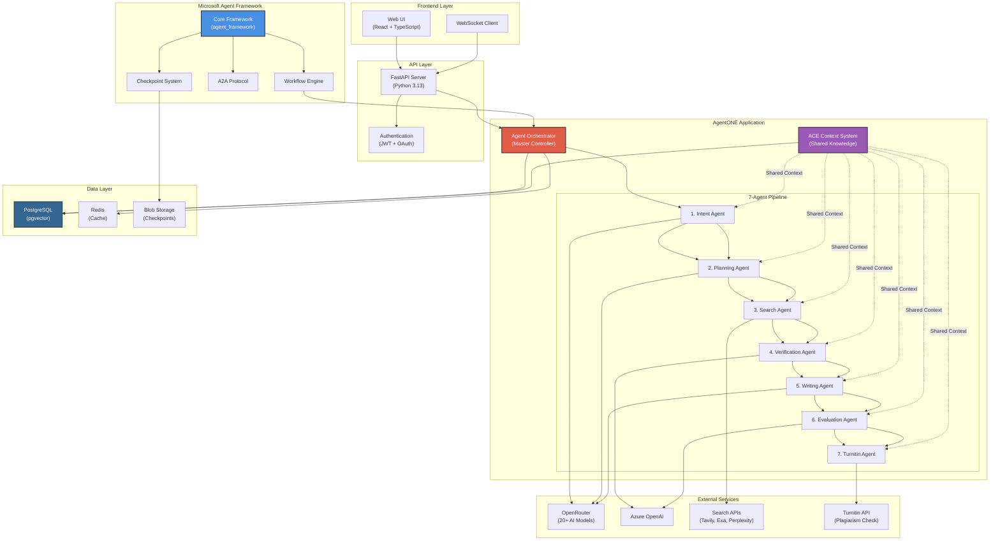
```mermaid
graph TB
    subgraph "Frontend Layer"
        WebUI["Web UI<br/>(React + TypeScript)"]
        WebSocket["WebSocket Client"]
    end

    subgraph "API Layer"
        FastAPI["FastAPI Server<br/>(Python 3.13)"]
        Auth["Authentication<br/>(JWT + OAuth)"]
    end

    subgraph "Microsoft Agent Framework"
        Core["Core Framework<br/>(agent_framework)"]
        Workflows["Workflow Engine"]
        A2A["A2A Protocol"]
        Checkpoint["Checkpoint System"]
    end

    subgraph "AgentONE Application"
        Orchestrator["Agent Orchestrator<br/>(Master Controller)"]
        ACE["ACE Context System<br/>(Shared Knowledge)"]

        subgraph "7-Agent Pipeline"
            direction LR
            A1["1. Intent Agent"]
            A2["2. Planning Agent"]
            A3["3. Search Agent"]
            A4["4. Verification Agent"]
            A5["5. Writing Agent"]
            A6["6. Evaluation Agent"]
            A7["7. Turnitin Agent"]

            A1 --> A2 --> A3 --> A4 --> A5 --> A6 --> A7
        end
    end

    subgraph "Data Layer"
        PostgreSQL["PostgreSQL<br/>(pgvector)"]
        Redis["Redis<br/>(Cache)"]
        BlobStorage["Blob Storage<br/>(Checkpoints)"]
    end

    subgraph "External Services"
        OpenRouter["OpenRouter<br/>(20+ AI Models)"]
        AzureAI["Azure OpenAI"]
        SearchAPIs["Search APIs<br/>(Tavily, Exa, Perplexity)"]
        Turnitin["Turnitin API<br/>(Plagiarism Check)"]
    end

    WebUI --> FastAPI
    WebSocket --> FastAPI
    FastAPI --> Auth
    FastAPI --> Orchestrator

    Core --> Workflows
    Core --> A2A
    Core --> Checkpoint
    Workflows --> Orchestrator

    Orchestrator --> A1
    A1 --> A2
    A2 --> A3
    A3 --> A4
    A4 --> A5
    A5 --> A6
    A6 --> A7

    ACE -.->|Shared Context| A1
    ACE -.->|Shared Context| A2
    ACE -.->|Shared Context| A3
    ACE -.->|Shared Context| A4
    ACE -.->|Shared Context| A5
    ACE -.->|Shared Context| A6
    ACE -.->|Shared Context| A7

    Orchestrator --> PostgreSQL
    Orchestrator --> Redis
    Checkpoint --> BlobStorage

    A1 --> OpenRouter
    A2 --> OpenRouter
    A3 --> SearchAPIs
    A4 --> AzureAI
    A5 --> OpenRouter
    A6 --> AzureAI
    A7 --> Turnitin

    ACE --> PostgreSQL

    style Core fill:#4A90E2,stroke:#333,stroke-width:2px,color:#fff
    style Orchestrator fill:#E25C4A,stroke:#333,stroke-width:2px,color:#fff
    style ACE fill:#9B59B6,stroke:#333,stroke-width:2px,color:#fff
    style PostgreSQL fill:#336791,stroke:#333,stroke-width:2px,color:#fff
```

### Component Dependency Graph

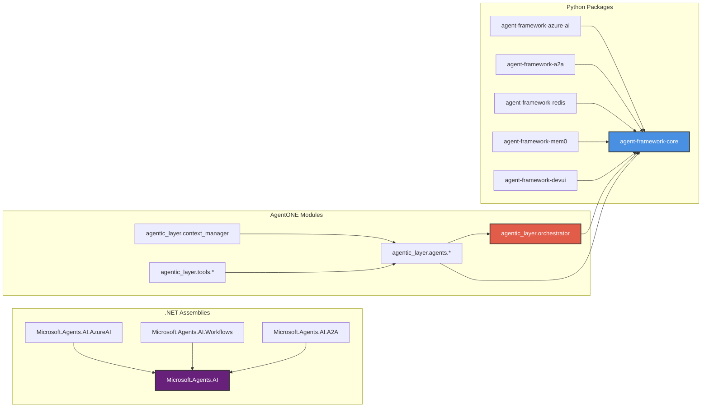
```mermaid
graph LR
    subgraph "Python Packages"
        Core["agent-framework-core"]
        AzureAI["agent-framework-azure-ai"]
        A2A_PKG["agent-framework-a2a"]
        Redis_PKG["agent-framework-redis"]
        Mem0["agent-framework-mem0"]
        DevUI["agent-framework-devui"]
    end

    subgraph ".NET Assemblies"
        DotNetCore["Microsoft.Agents.AI"]
        DotNetAzure["Microsoft.Agents.AI.AzureAI"]
        DotNetWorkflows["Microsoft.Agents.AI.Workflows"]
        DotNetA2A["Microsoft.Agents.AI.A2A"]
    end

    subgraph "AgentONE Modules"
        Orchestrator_Mod["agentic_layer.orchestrator"]
        Agents["agentic_layer.agents.*"]
        Context["agentic_layer.context_manager"]
        Tools["agentic_layer.tools.*"]
    end

    AzureAI --> Core
    A2A_PKG --> Core
    Redis_PKG --> Core
    Mem0 --> Core
    DevUI --> Core

    DotNetAzure --> DotNetCore
    DotNetWorkflows --> DotNetCore
    DotNetA2A --> DotNetCore

    Orchestrator_Mod --> Core
    Agents --> Core
    Agents --> Orchestrator_Mod
    Context --> Agents
    Tools --> Agents

    style Core fill:#4A90E2,stroke:#333,stroke-width:2px,color:#fff
    style DotNetCore fill:#68217A,stroke:#333,stroke-width:2px,color:#fff
    style Orchestrator_Mod fill:#E25C4A,stroke:#333,stroke-width:2px,color:#fff
```

---

## Framework Workflow Patterns

### Sequential Workflow Pattern

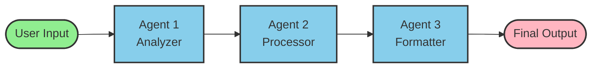
```mermaid
graph LR
    Start([User Input]) --> Agent1[Agent 1<br/>Analyzer]
    Agent1 --> Agent2[Agent 2<br/>Processor]
    Agent2 --> Agent3[Agent 3<br/>Formatter]
    Agent3 --> End([Final Output])

    style Start fill:#90EE90,stroke:#333,stroke-width:2px
    style End fill:#FFB6C1,stroke:#333,stroke-width:2px
    style Agent1 fill:#87CEEB,stroke:#333,stroke-width:2px
    style Agent2 fill:#87CEEB,stroke:#333,stroke-width:2px
    style Agent3 fill:#87CEEB,stroke:#333,stroke-width:2px
```

### Concurrent Workflow Pattern (Fan-Out/Fan-In)

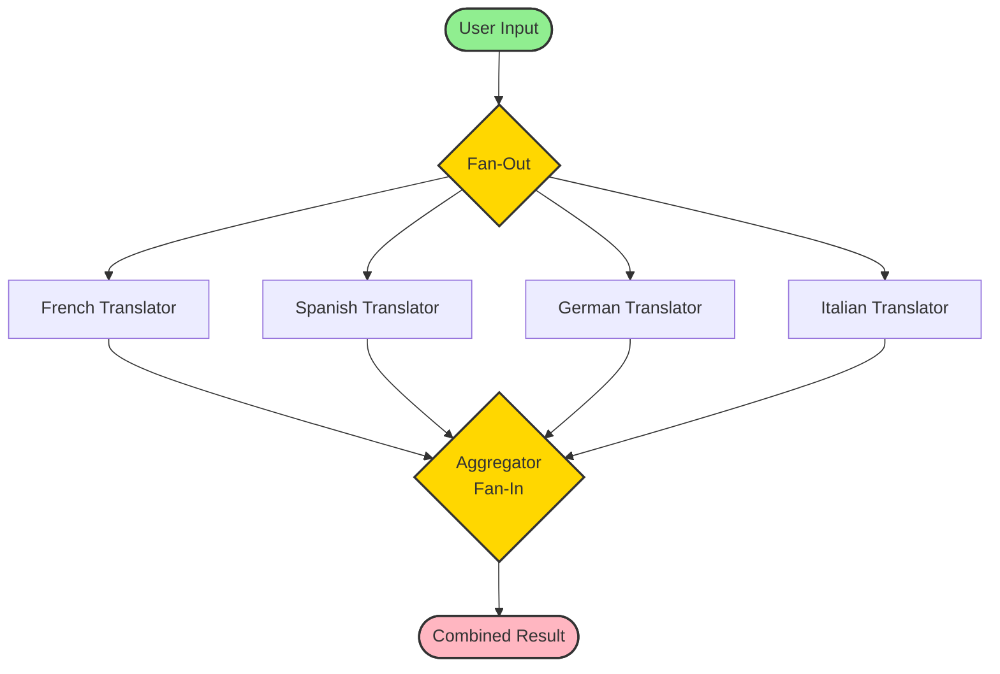
```mermaid
graph TB
    Start([User Input]) --> Fanout{Fan-Out}

    Fanout --> Agent1[French Translator]
    Fanout --> Agent2[Spanish Translator]
    Fanout --> Agent3[German Translator]
    Fanout --> Agent4[Italian Translator]

    Agent1 --> Aggregator{Aggregator<br/>Fan-In}
    Agent2 --> Aggregator
    Agent3 --> Aggregator
    Agent4 --> Aggregator

    Aggregator --> End([Combined Result])

    style Start fill:#90EE90,stroke:#333,stroke-width:2px
    style End fill:#FFB6C1,stroke:#333,stroke-width:2px
    style Fanout fill:#FFD700,stroke:#333,stroke-width:2px
    style Aggregator fill:#FFD700,stroke:#333,stroke-width:2px
```

### Magentic Workflow Pattern (Dynamic Collaboration)

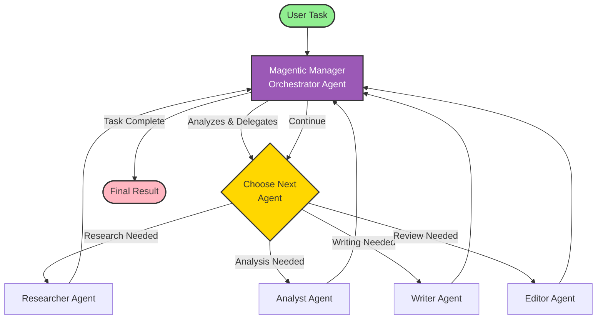
```mermaid
graph TB
    Start([User Task]) --> Manager[Magentic Manager<br/>Orchestrator Agent]

    Manager -->|Analyzes & Delegates| Decision{Choose Next<br/>Agent}

    Decision -->|Research Needed| Researcher[Researcher Agent]
    Decision -->|Analysis Needed| Analyst[Analyst Agent]
    Decision -->|Writing Needed| Writer[Writer Agent]
    Decision -->|Review Needed| Editor[Editor Agent]

    Researcher --> Manager
    Analyst --> Manager
    Writer --> Manager
    Editor --> Manager

    Manager -->|Task Complete| End([Final Result])
    Manager -->|Continue| Decision

    style Start fill:#90EE90,stroke:#333,stroke-width:2px
    style End fill:#FFB6C1,stroke:#333,stroke-width:2px
    style Manager fill:#9B59B6,stroke:#333,stroke-width:2px,color:#fff
    style Decision fill:#FFD700,stroke:#333,stroke-width:2px
```

### Hierarchical Workflow Pattern (Sub-Workflows)

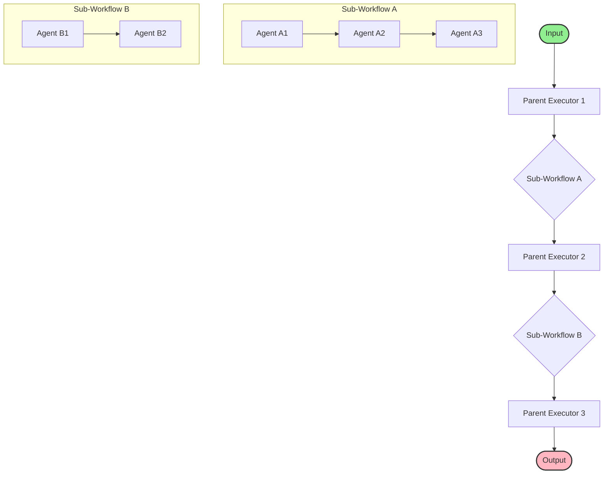
```mermaid
graph TB
    Start([Input]) --> Parent1[Parent Executor 1]

    Parent1 --> SubWorkflow1{Sub-Workflow A}

    subgraph "Sub-Workflow A"
        direction LR
        Sub1A[Agent A1] --> Sub1B[Agent A2] --> Sub1C[Agent A3]
    end

    SubWorkflow1 --> Parent2[Parent Executor 2]

    Parent2 --> SubWorkflow2{Sub-Workflow B}

    subgraph "Sub-Workflow B"
        direction LR
        Sub2A[Agent B1] --> Sub2B[Agent B2]
    end

    SubWorkflow2 --> Parent3[Parent Executor 3]
    Parent3 --> End([Output])

    style Start fill:#90EE90,stroke:#333,stroke-width:2px
    style End fill:#FFB6C1,stroke:#333,stroke-width:2px
```

---

## AgentONE Pipeline Flows

### Complete 7-Agent Pipeline


```mermaid
graph TB
    Start([User Input:<br/>Prompt + Documents]) --> Stage1

    subgraph "Stage 1: Understanding"
        Stage1[Intent Context Agent<br/>Model: GPT-5 Turbo<br/>Cost: ~$0.01]
        Stage1_Output[Output: IntentAnalysis<br/>- Document Type<br/>- Academic Level<br/>- Word Count<br/>- Key Requirements]
    end

    subgraph "Stage 2: Strategy"
        Stage2[Planning Agent<br/>Model: Claude 4.5 Sonnet<br/>Cost: ~$0.02]
        Stage2_Output[Output: ResearchPlan<br/>- 12-24 Search Queries<br/>- Section Templates<br/>- Writing Strategy]
    end

    subgraph "Stage 3: Research"
        Stage3[Evidence Search Agent<br/>Model: Gemini 2.5 Flash<br/>APIs: Tavily + Exa + Perplexity<br/>Cost: ~$0.10]
        Stage3_Output[Output: SearchAgentResult<br/>- 50-100 Sources<br/>- Relevance Scores<br/>- Deduplication]
    end

    subgraph "Stage 4: Quality Gate 1"
        Stage4[Verification Agent<br/>Model: GPT-5 Turbo<br/>Cost: ~$0.02]
        Stage4_Check{Quality Score<br/>> 0.7?}
        Stage4_Output[Output: VerificationResult<br/>- Quality Score<br/>- Fact-Check Results<br/>- Source Credibility]
    end

    subgraph "Stage 5: Creation"
        Stage5[Writing Agent<br/>Model: Claude 4.5 Sonnet<br/>Cost: ~$0.15]
        Stage5_Output[Output: WritingAgentResult<br/>- Full Draft<br/>- Sections<br/>- Citations<br/>- Word Count]
    end

    subgraph "Stage 6: Quality Gate 2"
        Stage6[Evaluation Agent<br/>Model: GPT-5 Turbo<br/>Cost: ~$0.02]
        Stage6_Check{Total Score<br/>> 75%?}
        Stage6_Output[Output: EvaluationResult<br/>- Coherence Score<br/>- Citation Quality<br/>- Grammar Score<br/>- Recommendations]
    end

    subgraph "Stage 7: Compliance"
        Stage7[Turnitin Agent<br/>API: Turnitin<br/>Cost: ~$0.05]
        Stage7_Output[Output: TurnitinResult<br/>- Similarity Score<br/>- AI Detection<br/>- Report URL]
    end

    Result([Final Result:<br/>Draft + Metadata + Reports])

    Stage1 --> Stage1_Output
    Stage1_Output --> Stage2
    Stage2 --> Stage2_Output
    Stage2_Output --> Stage3
    Stage3 --> Stage3_Output
    Stage3_Output --> Stage4
    Stage4 --> Stage4_Check
    Stage4_Check -->|PASS| Stage4_Output
    Stage4_Check -->|FAIL| Stage3
    Stage4_Output --> Stage5
    Stage5 --> Stage5_Output
    Stage5_Output --> Stage6
    Stage6 --> Stage6_Check
    Stage6_Check -->|PASS| Stage6_Output
    Stage6_Check -->|FAIL| Stage5
    Stage6_Output --> Stage7
    Stage7 --> Stage7_Output
    Stage7_Output --> Result

    style Start fill:#90EE90,stroke:#333,stroke-width:3px
    style Result fill:#FFB6C1,stroke:#333,stroke-width:3px
    style Stage1 fill:#FFE5B4,stroke:#333,stroke-width:2px
    style Stage2 fill:#B4D7FF,stroke:#333,stroke-width:2px
    style Stage3 fill:#C4E1C4,stroke:#333,stroke-width:2px
    style Stage4 fill:#FFC4D4,stroke:#333,stroke-width:2px
    style Stage5 fill:#E5CCFF,stroke:#333,stroke-width:2px
    style Stage6 fill:#FFD4B4,stroke:#333,stroke-width:2px
    style Stage7 fill:#D4FFD4,stroke:#333,stroke-width:2px
    style Stage4_Check fill:#FF6B6B,stroke:#333,stroke-width:2px,color:#fff
    style Stage6_Check fill:#FF6B6B,stroke:#333,stroke-width:2px,color:#fff
```

### Intent Agent Detailed Flow

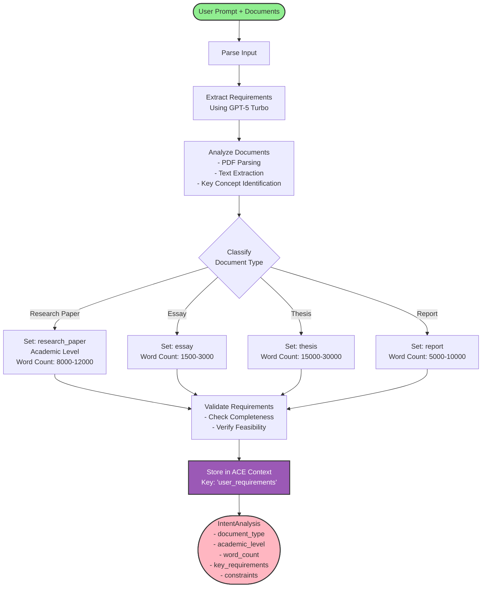
```mermaid
graph TB
    Start([User Prompt + Documents]) --> Parse[Parse Input]

    Parse --> ExtractReq[Extract Requirements<br/>Using GPT-5 Turbo]

    ExtractReq --> AnalyzeDoc[Analyze Documents<br/>- PDF Parsing<br/>- Text Extraction<br/>- Key Concept Identification]

    AnalyzeDoc --> ClassifyType{Classify<br/>Document Type}

    ClassifyType -->|Research Paper| SetPaper[Set: research_paper<br/>Academic Level<br/>Word Count: 8000-12000]
    ClassifyType -->|Essay| SetEssay[Set: essay<br/>Word Count: 1500-3000]
    ClassifyType -->|Thesis| SetThesis[Set: thesis<br/>Word Count: 15000-30000]
    ClassifyType -->|Report| SetReport[Set: report<br/>Word Count: 5000-10000]

    SetPaper --> Validate
    SetEssay --> Validate
    SetThesis --> Validate
    SetReport --> Validate

    Validate[Validate Requirements<br/>- Check Completeness<br/>- Verify Feasibility]

    Validate --> ACE[Store in ACE Context<br/>Key: 'user_requirements']

    ACE --> Output([IntentAnalysis<br/>- document_type<br/>- academic_level<br/>- word_count<br/>- key_requirements<br/>- constraints])

    style Start fill:#90EE90,stroke:#333,stroke-width:2px
    style Output fill:#FFB6C1,stroke:#333,stroke-width:2px
    style ACE fill:#9B59B6,stroke:#333,stroke-width:2px,color:#fff
```

### Search Agent Multi-API Flow

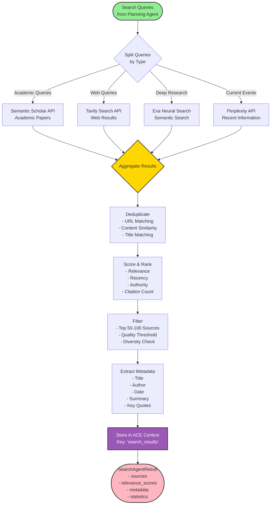
```mermaid
graph TB
    Start([Search Queries<br/>from Planning Agent]) --> Split{Split Queries<br/>by Type}

    Split -->|Academic Queries| Semantic[Semantic Scholar API<br/>Academic Papers]
    Split -->|Web Queries| Tavily[Tavily Search API<br/>Web Results]
    Split -->|Deep Research| Exa[Exa Neural Search<br/>Semantic Search]
    Split -->|Current Events| Perplexity[Perplexity API<br/>Recent Information]

    Semantic --> Aggregate{Aggregate Results}
    Tavily --> Aggregate
    Exa --> Aggregate
    Perplexity --> Aggregate

    Aggregate --> Deduplicate[Deduplicate<br/>- URL Matching<br/>- Content Similarity<br/>- Title Matching]

    Deduplicate --> Score[Score & Rank<br/>- Relevance<br/>- Recency<br/>- Authority<br/>- Citation Count]

    Score --> Filter[Filter<br/>- Top 50-100 Sources<br/>- Quality Threshold<br/>- Diversity Check]

    Filter --> Extract[Extract Metadata<br/>- Title<br/>- Author<br/>- Date<br/>- Summary<br/>- Key Quotes]

    Extract --> ACE[Store in ACE Context<br/>Key: 'search_results']

    ACE --> Output([SearchAgentResult<br/>- sources<br/>- relevance_scores<br/>- metadata<br/>- statistics])

    style Start fill:#90EE90,stroke:#333,stroke-width:2px
    style Output fill:#FFB6C1,stroke:#333,stroke-width:2px
    style ACE fill:#9B59B6,stroke:#333,stroke-width:2px,color:#fff
    style Aggregate fill:#FFD700,stroke:#333,stroke-width:2px
```

---

## Data Flow Diagrams

### Request-Response Flow

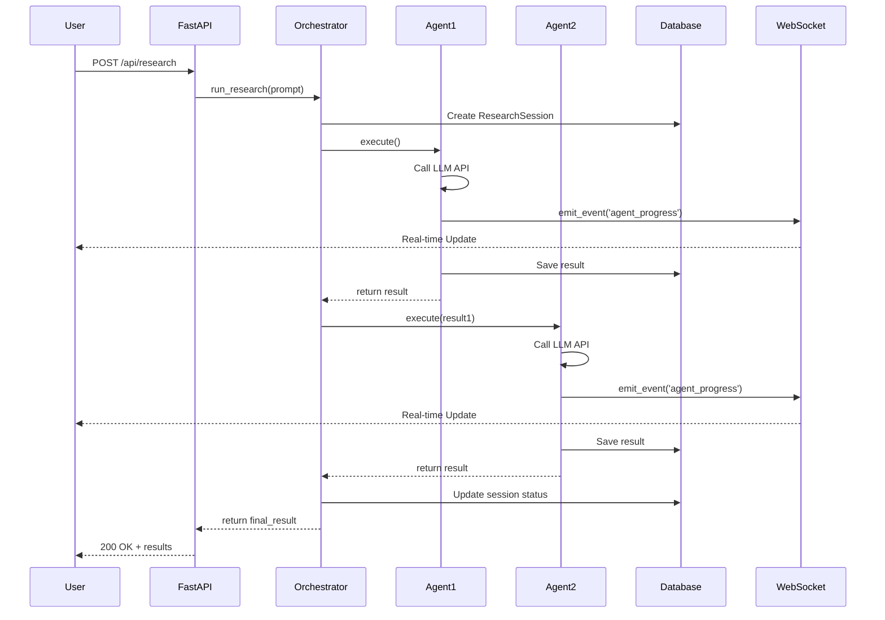
```mermaid
sequenceDiagram
    participant User
    participant FastAPI
    participant Orchestrator
    participant Agent1
    participant Agent2
    participant Database
    participant WebSocket

    User->>FastAPI: POST /api/research
    FastAPI->>Orchestrator: run_research(prompt)
    Orchestrator->>Database: Create ResearchSession

    Orchestrator->>Agent1: execute()
    Agent1->>Agent1: Call LLM API
    Agent1->>WebSocket: emit_event('agent_progress')
    WebSocket-->>User: Real-time Update
    Agent1->>Database: Save result
    Agent1-->>Orchestrator: return result

    Orchestrator->>Agent2: execute(result1)
    Agent2->>Agent2: Call LLM API
    Agent2->>WebSocket: emit_event('agent_progress')
    WebSocket-->>User: Real-time Update
    Agent2->>Database: Save result
    Agent2-->>Orchestrator: return result

    Orchestrator->>Database: Update session status
    Orchestrator-->>FastAPI: return final_result
    FastAPI-->>User: 200 OK + results
```

### ACE Context System Flow

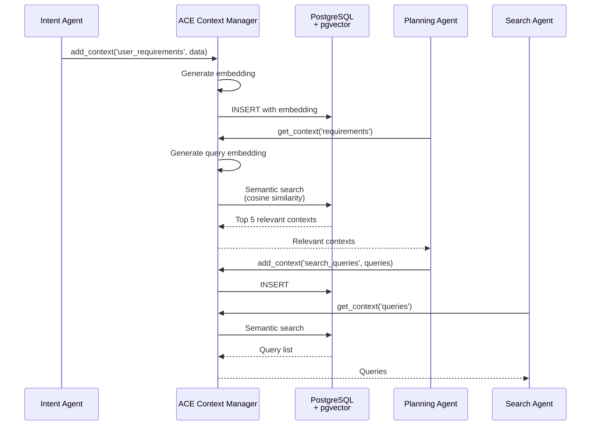
```mermaid
sequenceDiagram
    participant Agent1 as Intent Agent
    participant ACE as ACE Context Manager
    participant PGVector as PostgreSQL<br/>+ pgvector
    participant Agent2 as Planning Agent
    participant Agent3 as Search Agent

    Agent1->>ACE: add_context('user_requirements', data)
    ACE->>ACE: Generate embedding
    ACE->>PGVector: INSERT with embedding

    Agent2->>ACE: get_context('requirements')
    ACE->>ACE: Generate query embedding
    ACE->>PGVector: Semantic search<br/>(cosine similarity)
    PGVector-->>ACE: Top 5 relevant contexts
    ACE-->>Agent2: Relevant contexts

    Agent2->>ACE: add_context('search_queries', queries)
    ACE->>PGVector: INSERT

    Agent3->>ACE: get_context('queries')
    ACE->>PGVector: Semantic search
    PGVector-->>ACE: Query list
    ACE-->>Agent3: Queries
```

### Checkpointing Flow

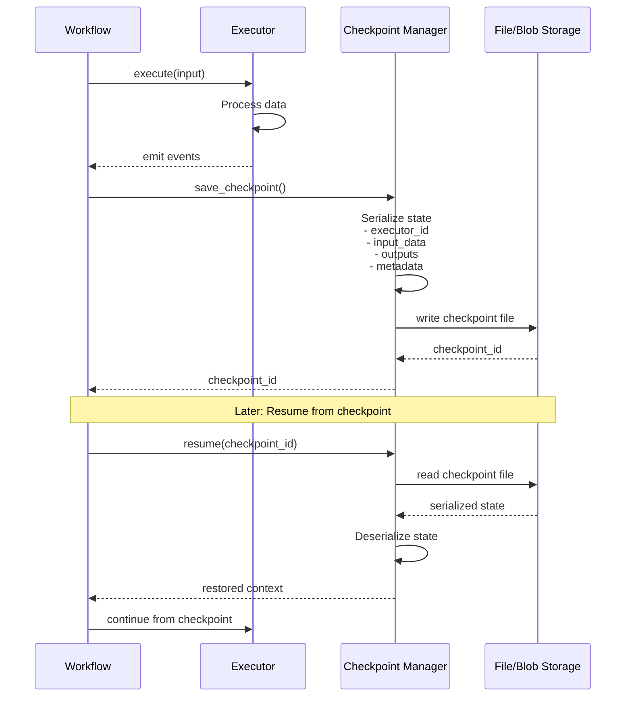
```mermaid
sequenceDiagram
    participant Workflow
    participant Executor
    participant CheckpointMgr as Checkpoint Manager
    participant Storage as File/Blob Storage

    Workflow->>Executor: execute(input)
    Executor->>Executor: Process data
    Executor-->>Workflow: emit events

    Workflow->>CheckpointMgr: save_checkpoint()
    CheckpointMgr->>CheckpointMgr: Serialize state<br/>- executor_id<br/>- input_data<br/>- outputs<br/>- metadata
    CheckpointMgr->>Storage: write checkpoint file
    Storage-->>CheckpointMgr: checkpoint_id
    CheckpointMgr-->>Workflow: checkpoint_id

    Note over Workflow,Storage: Later: Resume from checkpoint

    Workflow->>CheckpointMgr: resume(checkpoint_id)
    CheckpointMgr->>Storage: read checkpoint file
    Storage-->>CheckpointMgr: serialized state
    CheckpointMgr->>CheckpointMgr: Deserialize state
    CheckpointMgr-->>Workflow: restored context
    Workflow->>Executor: continue from checkpoint
```

---

## Component Interaction Diagrams

### Framework Core Interactions

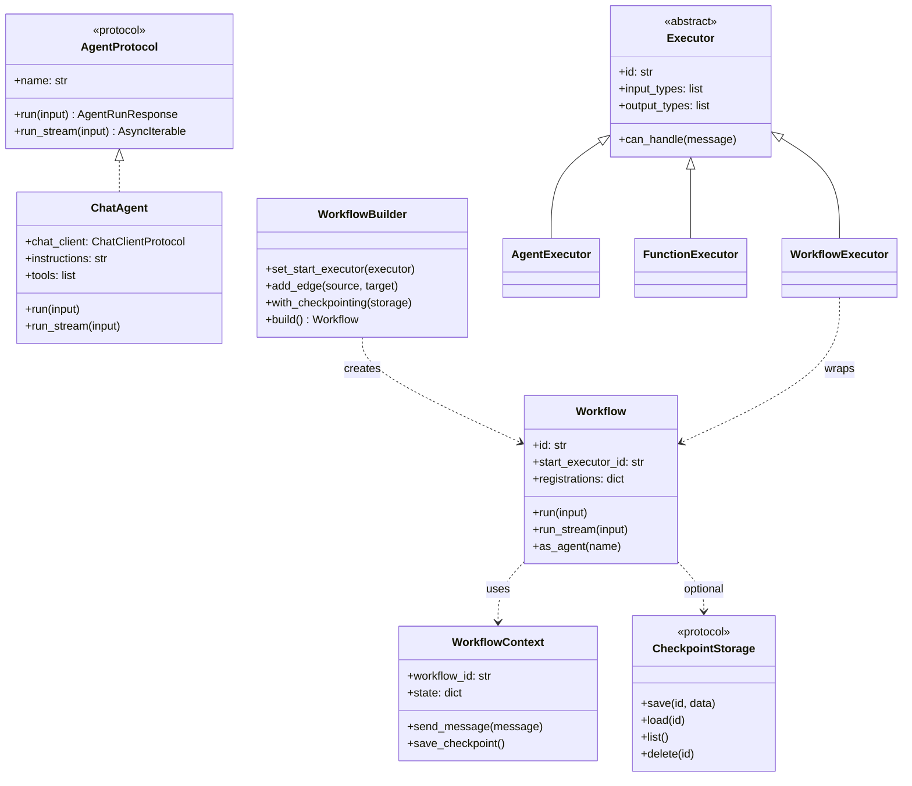
```mermaid
classDiagram
    class AgentProtocol {
        <<protocol>>
        +name: str
        +run(input) AgentRunResponse
        +run_stream(input) AsyncIterable
    }

    class ChatAgent {
        +chat_client: ChatClientProtocol
        +instructions: str
        +tools: list
        +run(input)
        +run_stream(input)
    }

    class WorkflowBuilder {
        +set_start_executor(executor)
        +add_edge(source, target)
        +with_checkpointing(storage)
        +build() Workflow
    }

    class Workflow {
        +id: str
        +start_executor_id: str
        +registrations: dict
        +run(input)
        +run_stream(input)
        +as_agent(name)
    }

    class Executor {
        <<abstract>>
        +id: str
        +input_types: list
        +output_types: list
        +can_handle(message)
    }

    class WorkflowContext {
        +workflow_id: str
        +state: dict
        +send_message(message)
        +save_checkpoint()
    }

    class CheckpointStorage {
        <<protocol>>
        +save(id, data)
        +load(id)
        +list()
        +delete(id)
    }

    AgentProtocol <|.. ChatAgent
    Executor <|-- AgentExecutor
    Executor <|-- FunctionExecutor
    Executor <|-- WorkflowExecutor
    WorkflowBuilder ..> Workflow : creates
    Workflow ..> WorkflowContext : uses
    Workflow ..> CheckpointStorage : optional
    WorkflowExecutor ..> Workflow : wraps
```

### AgentONE Orchestrator Interactions

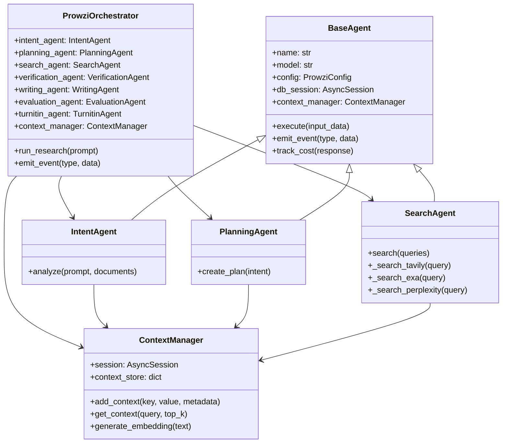
```mermaid
classDiagram
    class ProwziOrchestrator {
        +intent_agent: IntentAgent
        +planning_agent: PlanningAgent
        +search_agent: SearchAgent
        +verification_agent: VerificationAgent
        +writing_agent: WritingAgent
        +evaluation_agent: EvaluationAgent
        +turnitin_agent: TurnitinAgent
        +context_manager: ContextManager
        +run_research(prompt)
        +emit_event(type, data)
    }

    class BaseAgent {
        +name: str
        +model: str
        +config: ProwziConfig
        +db_session: AsyncSession
        +context_manager: ContextManager
        +execute(input_data)
        +emit_event(type, data)
        +track_cost(response)
    }

    class ContextManager {
        +session: AsyncSession
        +context_store: dict
        +add_context(key, value, metadata)
        +get_context(query, top_k)
        +generate_embedding(text)
    }

    class IntentAgent {
        +analyze(prompt, documents)
    }

    class PlanningAgent {
        +create_plan(intent)
    }

    class SearchAgent {
        +search(queries)
        +_search_tavily(query)
        +_search_exa(query)
        +_search_perplexity(query)
    }

    ProwziOrchestrator --> IntentAgent
    ProwziOrchestrator --> PlanningAgent
    ProwziOrchestrator --> SearchAgent
    ProwziOrchestrator --> ContextManager

    BaseAgent <|-- IntentAgent
    BaseAgent <|-- PlanningAgent
    BaseAgent <|-- SearchAgent

    IntentAgent --> ContextManager
    PlanningAgent --> ContextManager
    SearchAgent --> ContextManager
```

---

## State Machine Diagrams

### Workflow Execution State Machine

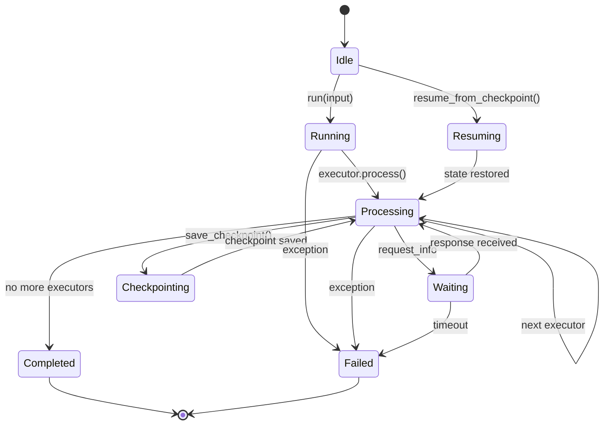
```mermaid
stateDiagram-v2
    [*] --> Idle

    Idle --> Running : run(input)
    Running --> Processing : executor.process()
    Processing --> Processing : next executor
    Processing --> Waiting : request_info
    Waiting --> Processing : response received
    Processing --> Checkpointing : save_checkpoint()
    Checkpointing --> Processing : checkpoint saved
    Processing --> Completed : no more executors
    Completed --> [*]

    Running --> Failed : exception
    Processing --> Failed : exception
    Waiting --> Failed : timeout
    Failed --> [*]

    Idle --> Resuming : resume_from_checkpoint()
    Resuming --> Processing : state restored
```

### Agent Execution State Machine

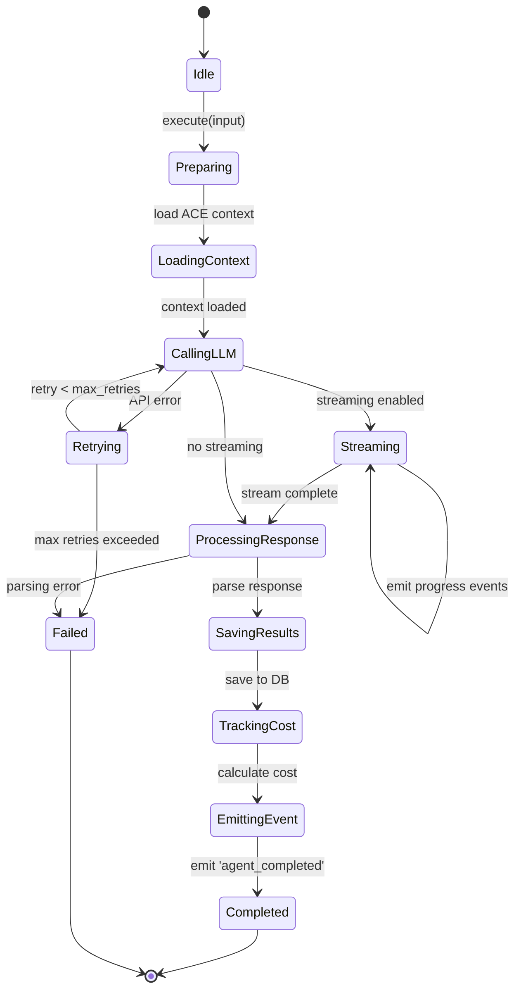
```mermaid
stateDiagram-v2
    [*] --> Idle

    Idle --> Preparing : execute(input)
    Preparing --> LoadingContext : load ACE context
    LoadingContext --> CallingLLM : context loaded
    CallingLLM --> Streaming : streaming enabled
    Streaming --> Streaming : emit progress events
    Streaming --> ProcessingResponse : stream complete
    CallingLLM --> ProcessingResponse : no streaming
    ProcessingResponse --> SavingResults : parse response
    SavingResults --> TrackingCost : save to DB
    TrackingCost --> EmittingEvent : calculate cost
    EmittingEvent --> Completed : emit 'agent_completed'
    Completed --> [*]

    CallingLLM --> Retrying : API error
    Retrying --> CallingLLM : retry < max_retries
    Retrying --> Failed : max retries exceeded
    ProcessingResponse --> Failed : parsing error
    Failed --> [*]
```

### Quality Gate State Machine

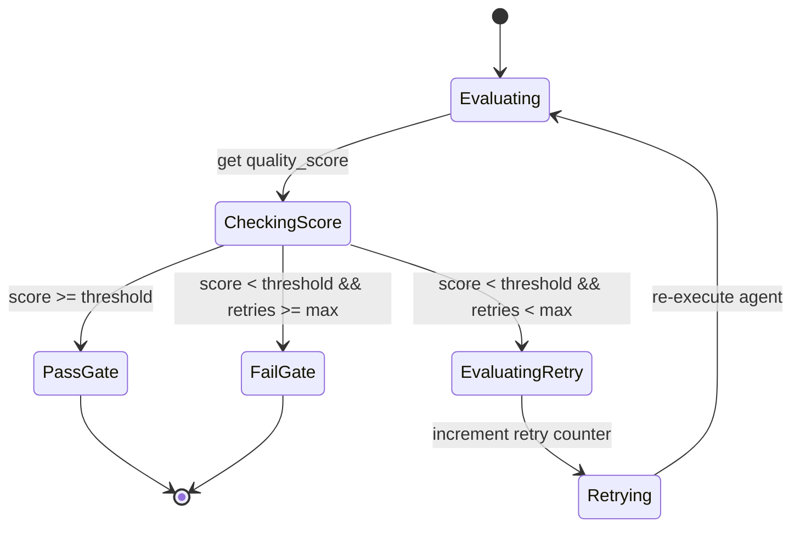
```mermaid
stateDiagram-v2
    [*] --> Evaluating

    Evaluating --> CheckingScore : get quality_score
    CheckingScore --> PassGate : score >= threshold
    CheckingScore --> EvaluatingRetry : score < threshold && retries < max
    CheckingScore --> FailGate : score < threshold && retries >= max

    EvaluatingRetry --> Retrying : increment retry counter
    Retrying --> Evaluating : re-execute agent

    PassGate --> [*]
    FailGate --> [*]
```

---

## Performance & Scaling Diagrams

### Load Balancing Architecture

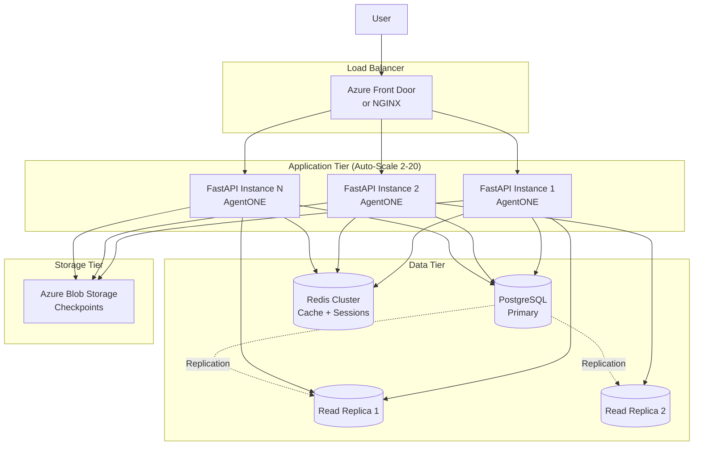
```mermaid
graph TB
    subgraph "Load Balancer"
        LB[Azure Front Door<br/>or NGINX]
    end

    subgraph "Application Tier (Auto-Scale 2-20)"
        App1[FastAPI Instance 1<br/>AgentONE]
        App2[FastAPI Instance 2<br/>AgentONE]
        App3[FastAPI Instance N<br/>AgentONE]
    end

    subgraph "Data Tier"
        PG[(PostgreSQL<br/>Primary)]
        PGRead1[(Read Replica 1)]
        PGRead2[(Read Replica 2)]
        Redis[(Redis Cluster<br/>Cache + Sessions)]
    end

    subgraph "Storage Tier"
        Blob[Azure Blob Storage<br/>Checkpoints]
    end

    User --> LB
    LB --> App1
    LB --> App2
    LB --> App3

    App1 --> PG
    App2 --> PG
    App3 --> PG

    App1 --> PGRead1
    App2 --> PGRead2
    App3 --> PGRead1

    App1 --> Redis
    App2 --> Redis
    App3 --> Redis

    App1 --> Blob
    App2 --> Blob
    App3 --> Blob

    PG -.->|Replication| PGRead1
    PG -.->|Replication| PGRead2
```

### Token Usage Flow

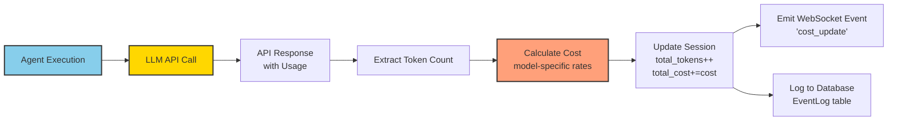
```mermaid
graph LR
    Agent[Agent Execution] --> API[LLM API Call]
    API --> Response[API Response<br/>with Usage]
    Response --> Extract[Extract Token Count]
    Extract --> Calculate[Calculate Cost<br/>model-specific rates]
    Calculate --> Update[Update Session<br/>total_tokens++<br/>total_cost+=cost]
    Update --> Emit[Emit WebSocket Event<br/>'cost_update']
    Update --> Log[Log to Database<br/>EventLog table]

    style Agent fill:#87CEEB,stroke:#333,stroke-width:2px
    style API fill:#FFD700,stroke:#333,stroke-width:2px
    style Calculate fill:#FFA07A,stroke:#333,stroke-width:2px
```

---

## Deployment Diagrams

### Development Environment

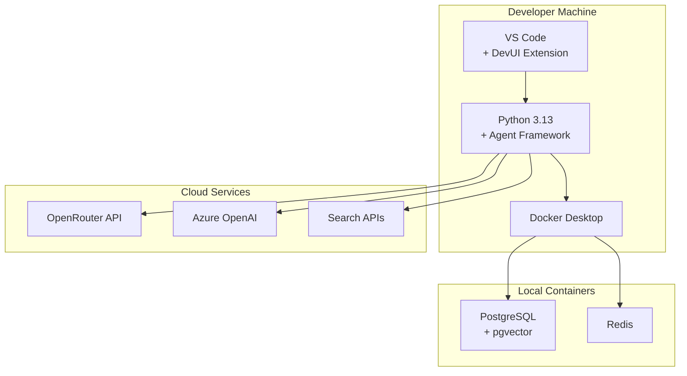
```mermaid
graph TB
    subgraph "Developer Machine"
        VSCode[VS Code<br/>+ DevUI Extension]
        Python[Python 3.13<br/>+ Agent Framework]
        Docker[Docker Desktop]
    end

    subgraph "Local Containers"
        PG[PostgreSQL<br/>+ pgvector]
        RedisLocal[Redis]
    end

    subgraph "Cloud Services"
        OpenRouter[OpenRouter API]
        Azure[Azure OpenAI]
        Search[Search APIs]
    end

    VSCode --> Python
    Python --> Docker
    Docker --> PG
    Docker --> RedisLocal

    Python --> OpenRouter
    Python --> Azure
    Python --> Search
```

### Production Deployment (Azure)

```mermaid
graph TB
    subgraph "Azure Region: East US"
        subgraph "Networking"
            FrontDoor[Azure Front Door<br/>CDN + WAF]
            VNet[Virtual Network<br/>10.0.0.0/16]
        end

        subgraph "App Service"
            AppPlan[Premium App Service Plan<br/>P2v3 - 2-20 instances]
            App[AgentONE FastAPI<br/>Python 3.13]
        end

        subgraph "Data Services"
            PG[Azure PostgreSQL<br/>Flexible Server<br/>+ pgvector]
            Redis[Azure Cache for Redis<br/>Premium tier]
            Blob[Azure Blob Storage<br/>Hot tier]
        end

        subgraph "Monitoring"
            AppInsights[Application Insights]
            LogAnalytics[Log Analytics Workspace]
        end

        subgraph "Security"
            KeyVault[Azure Key Vault]
            ManagedIdentity[Managed Identity]
        end
    end

    Internet --> FrontDoor
    FrontDoor --> VNet
    VNet --> AppPlan
    AppPlan --> App

    App --> PG
    App --> Redis
    App --> Blob
    App --> KeyVault
    App --> AppInsights

    ManagedIdentity -.->|Authentication| App
    App -.->|Logs & Metrics| LogAnalytics
```

---

## Next Steps

- **[System Architecture](./SYSTEM_ARCHITECTURE.md)** - Detailed architecture documentation
- **[Workflow Patterns](./WORKFLOW_PATTERNS.md)** - Implementation patterns
- **[API Reference](../API_REFERENCE.md)** - Complete API docs
- **[Deployment Guide](../DEPLOYMENT_GUIDE.md)** - Production deployment

---

**Rendering These Diagrams:**

1. **GitHub**: Diagrams auto-render in markdown preview
2. **VS Code**: Install "Markdown Preview Mermaid Support" extension
3. **Mermaid Live**: Paste code at [mermaid.live](https://mermaid.live/)
4. **Export**: Use mermaid-cli (`mmdc`) to generate PNG/SVG

```bash
# Install mermaid-cli
npm install -g @mermaid-js/mermaid-cli

# Convert to PNG
mmdc -i VISUAL_FLOWS.md -o diagrams/
```
