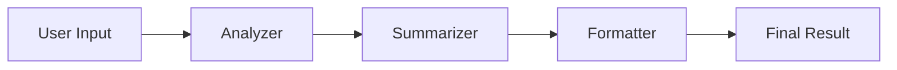
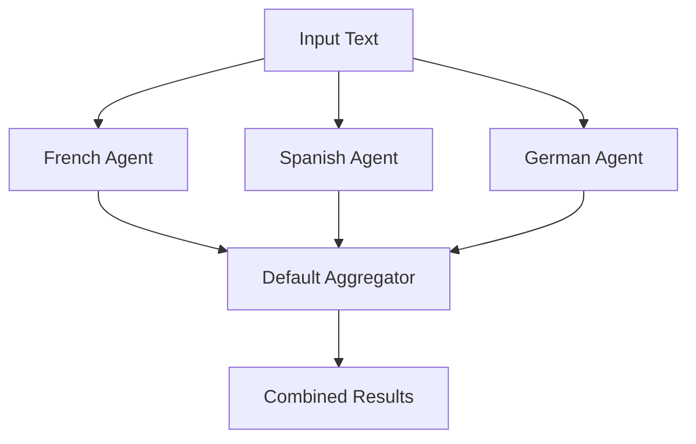
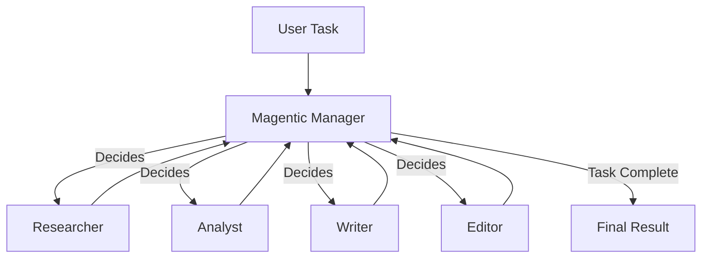

# Workflow Patterns & Recipes

> **Last Updated**: January 15, 2025  
> **Difficulty**: Intermediate to Advanced  
> **Prerequisites**: Understanding of Microsoft Agent Framework basics

---

## Table of Contents

1. [Pattern Overview](#pattern-overview)
2. [Sequential Workflows](#sequential-workflows)
3. [Concurrent Workflows](#concurrent-workflows)
4. [Magentic Workflows](#magentic-workflows)
5. [Hierarchical Workflows](#hierarchical-workflows)
6. [Human-in-the-Loop](#human-in-the-loop)
7. [Checkpointing & Resume](#checkpointing--resume)
8. [Error Handling Patterns](#error-handling-patterns)
9. [AgentONE Pipeline Pattern](#agentone-pipeline-pattern)
10. [Performance Optimization](#performance-optimization)

---

## Pattern Overview

Microsoft Agent Framework supports multiple orchestration patterns:

| Pattern | Use Case | Complexity | Parallelism |
|---------|----------|------------|-------------|
| **Sequential** | Linear pipeline, each step depends on previous | Low | None |
| **Concurrent** | Independent parallel tasks, aggregate results | Medium | High |
| **Magentic** | Dynamic multi-agent collaboration | High | Dynamic |
| **Hierarchical** | Workflows containing sub-workflows | High | Nested |
| **Request-Response** | External input during execution | Medium | Paused |

---

## Sequential Workflows

### Basic Sequential Pattern

**Use Case**: Linear processing pipeline where each agent builds on previous results.

```python
from agent_framework import SequentialBuilder, ChatAgent
from agent_framework.openai import OpenAIChatClient

# Create agents
analyzer = ChatAgent(
    chat_client=OpenAIChatClient(),
    name="Analyzer",
    instructions="Analyze the input and identify key themes."
)

summarizer = ChatAgent(
    chat_client=OpenAIChatClient(),
    name="Summarizer",
    instructions="Create a concise summary of the analysis."
)

formatter = ChatAgent(
    chat_client=OpenAIChatClient(),
    name="Formatter",
    instructions="Format the summary as a structured report."
)

# Build sequential workflow
workflow = (
    SequentialBuilder()
    .add_agent(analyzer)
    .add_agent(summarizer)
    .add_agent(formatter)
    .build()
)

# Execute
result = await workflow.run("Analyze this market research report: ...")
print(result[-1].data)  # Final formatted report
```

**Flow Diagram:**


### Sequential with Custom Executors

**Use Case**: Mix agents with custom Python functions for data transformation.

```python
from agent_framework import WorkflowBuilder, executor
from typing import List

@executor
async def extract_keywords(text: str, ctx: WorkflowContext) -> List[str]:
    """Extract keywords using basic NLP"""
    # Custom processing logic
    keywords = text.lower().split()
    keywords = [k for k in keywords if len(k) > 4]
    return list(set(keywords))[:10]

@executor
async def format_report(keywords: List[str], ctx: WorkflowContext) -> str:
    """Format keywords as markdown"""
    return "## Keywords\n\n" + "\n".join(f"- {k}" for k in keywords)

# Mix agents and functions
workflow = (
    WorkflowBuilder()
    .set_start_executor(analyzer)
    .add_edge(analyzer, extract_keywords)
    .add_edge(extract_keywords, format_report)
    .build()
)
```

**When to Use:**
- Need deterministic processing steps
- Want to combine AI with traditional code
- Data transformation between agents

---

## Concurrent Workflows

### Basic Concurrent Pattern (Fan-Out/Fan-In)

**Use Case**: Execute multiple independent tasks in parallel and aggregate results.

```python
from agent_framework import ConcurrentBuilder, ChatMessage

# Create specialized agents
french_agent = ChatAgent(
    chat_client=OpenAIChatClient(),
    name="French Translator",
    instructions="Translate to French"
)

spanish_agent = ChatAgent(
    chat_client=OpenAIChatClient(),
    name="Spanish Translator",
    instructions="Translate to Spanish"
)

german_agent = ChatAgent(
    chat_client=OpenAIChatClient(),
    name="German Translator",
    instructions="Translate to German"
)

# Concurrent execution with default aggregator
workflow = (
    ConcurrentBuilder()
    .add_agents([french_agent, spanish_agent, german_agent])
    .build()
)

result = await workflow.run("Hello, world!")
# Returns: list of ChatMessage from all agents
```

**Flow Diagram:**


### Custom Aggregator Pattern

**Use Case**: Intelligent result combination using another agent.

```python
async def intelligent_aggregator(results: List[AgentRunResponse]) -> str:
    """Use an LLM to synthesize results"""
    # Extract text from all results
    translations = [r.messages[0].text for r in results]
    
    # Create synthesis agent
    synthesizer = ChatAgent(
        chat_client=OpenAIChatClient(),
        instructions="Compare these translations and explain differences."
    )
    
    comparison_text = "\n\n".join(f"**Translation {i+1}**:\n{t}" 
                                   for i, t in enumerate(translations))
    
    synthesis = await synthesizer.run(comparison_text)
    return synthesis.messages[0].text

workflow = (
    ConcurrentBuilder()
    .add_agents([french_agent, spanish_agent, german_agent])
    .with_aggregator(intelligent_aggregator)
    .build()
)
```

### Domain Expert Pattern

**Use Case**: Get opinions from multiple domain experts, then synthesize.

```python
# Create domain experts
marketing_expert = ChatAgent(
    name="Marketing Expert",
    instructions="Analyze from marketing perspective"
)

technical_expert = ChatAgent(
    name="Technical Expert",
    instructions="Analyze from technical feasibility perspective"
)

financial_expert = ChatAgent(
    name="Financial Expert",
    instructions="Analyze from cost/ROI perspective"
)

decision_maker = ChatAgent(
    name="Decision Maker",
    instructions="Synthesize expert opinions and make final recommendation"
)

# Concurrent expert analysis + sequential synthesis
expert_workflow = (
    ConcurrentBuilder()
    .add_agents([marketing_expert, technical_expert, financial_expert])
    .build()
)

full_workflow = (
    WorkflowBuilder()
    .set_start_executor(WorkflowExecutor(expert_workflow))
    .add_edge(expert_workflow, decision_maker)
    .build()
)
```

---

## Magentic Workflows

### Basic Magentic Pattern

**Use Case**: Dynamic multi-agent collaboration where agents decide who speaks next.

```python
from agent_framework import MagenticBuilder

# Create participant agents
researcher = ChatAgent(
    name="Researcher",
    instructions="Research facts and gather information"
)

analyst = ChatAgent(
    name="Analyst",
    instructions="Analyze data and identify patterns"
)

writer = ChatAgent(
    name="Writer",
    instructions="Write clear, engaging content"
)

editor = ChatAgent(
    name="Editor",
    instructions="Review and refine content"
)

# Build Magentic workflow
workflow = (
    MagenticBuilder()
    .add_participant(researcher)
    .add_participant(analyst)
    .add_participant(writer)
    .add_participant(editor)
    .with_max_rounds(10)
    .build()
)

# Execute
result = await workflow.run_stream("Write a comprehensive report on quantum computing")

async for event in result:
    if event.agent_name:
        print(f"[{event.agent_name}]: {event.data}")
```

**Flow Diagram:**


### Magentic with Human-in-the-Loop

**Use Case**: Review and approve the plan before execution.

```python
from agent_framework import RequestInfoExecutor

# Add human approval step
approval_executor = RequestInfoExecutor(
    id="human_approval",
    request_text="Review the execution plan. Approve or suggest changes?"
)

workflow = (
    MagenticBuilder()
    .add_participant(researcher)
    .add_participant(analyst)
    .add_participant(writer)
    .with_approval_step(approval_executor)  # Human reviews plan
    .build()
)

# Start workflow
async for event in workflow.run_stream("Task description"):
    if event.type == "request_info":
        # Pause for human input
        user_approval = input("Approve plan? (yes/no/changes): ")
        
        if user_approval.lower() == "yes":
            await workflow.send_response(RequestResponse(
                response_id=event.request_id,
                data={"approved": True}
            ))
        else:
            await workflow.send_response(RequestResponse(
                response_id=event.request_id,
                data={"approved": False, "feedback": user_approval}
            ))
```

---

## Hierarchical Workflows

### Sub-Workflow Pattern

**Use Case**: Reusable workflow components.

```python
from agent_framework import WorkflowExecutor

# Create reusable sub-workflow for text processing
def create_text_processing_workflow():
    cleaner = executor(async def clean_text(text: str, ctx) -> str:
        return text.strip().lower()
    )
    
    analyzer = ChatAgent(
        name="Text Analyzer",
        instructions="Analyze text quality and structure"
    )
    
    return (
        WorkflowBuilder()
        .set_start_executor(cleaner)
        .add_edge(cleaner, analyzer)
        .build()
    )

# Use sub-workflow in parent workflow
text_processor = WorkflowExecutor(create_text_processing_workflow())

parent_workflow = (
    WorkflowBuilder()
    .set_start_executor(orchestrator)
    .add_edge(orchestrator, text_processor)  # Sub-workflow as executor
    .add_edge(text_processor, final_agent)
    .build()
)
```

### Multi-Level Orchestration

**Use Case**: Complex systems with multiple orchestration layers.

```python
# Level 1: Task-specific workflows
research_workflow = create_research_workflow()
analysis_workflow = create_analysis_workflow()
writing_workflow = create_writing_workflow()

# Level 2: Department-level orchestration
content_dept_workflow = (
    WorkflowBuilder()
    .set_start_executor(WorkflowExecutor(research_workflow))
    .add_edge(research_workflow, WorkflowExecutor(analysis_workflow))
    .add_edge(analysis_workflow, WorkflowExecutor(writing_workflow))
    .build()
)

# Level 3: Company-wide orchestration
master_workflow = (
    WorkflowBuilder()
    .set_start_executor(WorkflowExecutor(content_dept_workflow))
    .add_edge(content_dept_workflow, review_department)
    .add_edge(review_department, publishing_department)
    .build()
)
```

---

## Human-in-the-Loop

### Request-Response Pattern

**Use Case**: Get user input during workflow execution.

```python
from agent_framework import RequestInfoExecutor, RequestResponse

# Create approval gate
approval_gate = RequestInfoExecutor(
    id="approval_gate",
    request_text="Review the draft. Approve or request changes?"
)

workflow = (
    WorkflowBuilder()
    .set_start_executor(drafter)
    .add_edge(drafter, approval_gate)
    .add_edge(approval_gate, finalizer)  # Continues after response
    .build()
)

# Execute with response handling
async for event in workflow.run_stream(input_data):
    if event.type == "request_info":
        # Pause for user input
        print(f"System asks: {event.request_text}")
        print(f"Current draft: {event.data}")
        
        user_response = input("Your response: ")
        
        # Send response back to workflow
        await workflow.send_response(RequestResponse(
            response_id=event.request_id,
            data={"response": user_response}
        ))
    
    elif event.type == "agent_run_update":
        print(f"Progress: {event.data}")
```

### Multi-Step Approval Pattern

**Use Case**: Multiple approval gates in a workflow.

```python
# Multiple approval points
draft_approval = RequestInfoExecutor(id="draft_approval")
budget_approval = RequestInfoExecutor(id="budget_approval")
legal_approval = RequestInfoExecutor(id="legal_approval")

workflow = (
    WorkflowBuilder()
    .set_start_executor(drafter)
    .add_edge(drafter, draft_approval)
    .add_edge(draft_approval, cost_estimator)
    .add_edge(cost_estimator, budget_approval)
    .add_edge(budget_approval, legal_reviewer)
    .add_edge(legal_reviewer, legal_approval)
    .add_edge(legal_approval, finalizer)
    .build()
)

# Handle multiple approval requests
approval_handlers = {
    "draft_approval": lambda: input("Approve draft? "),
    "budget_approval": lambda: input("Approve budget? "),
    "legal_approval": lambda: input("Approve legal review? ")
}

async for event in workflow.run_stream(input_data):
    if event.type == "request_info":
        handler = approval_handlers[event.request_id]
        response = handler()
        await workflow.send_response(RequestResponse(
            response_id=event.request_id,
            data={"approved": response.lower() == "yes"}
        ))
```

---

## Checkpointing & Resume

### Basic Checkpointing

**Use Case**: Save workflow state for recovery.

```python
from agent_framework import FileCheckpointStorage

# Enable checkpointing
checkpoint_storage = FileCheckpointStorage("./checkpoints")

workflow = (
    WorkflowBuilder()
    .add_edge(agent1, agent2)
    .add_edge(agent2, agent3)
    .with_checkpointing(checkpoint_storage)
    .build()
)

# Workflow automatically checkpoints after each executor
result = await workflow.run(input_data)

# Resume from checkpoint
checkpoint_id = "abc123-def456"
result = await workflow.run_stream_from_checkpoint(checkpoint_id)
```

### Smart Checkpointing Strategy

**Use Case**: Checkpoint only at critical stages.

```python
from agent_framework import executor

@executor
async def checkpoint_trigger(data: Any, ctx: WorkflowContext) -> Any:
    """Trigger manual checkpoint"""
    if ctx.checkpointing_enabled:
        checkpoint_id = await ctx.save_checkpoint()
        print(f"Checkpoint saved: {checkpoint_id}")
    return data

workflow = (
    WorkflowBuilder()
    .add_edge(stage1, checkpoint_trigger)  # Checkpoint after stage 1
    .add_edge(checkpoint_trigger, stage2)
    .add_edge(stage2, stage3)
    .add_edge(stage3, checkpoint_trigger)  # Checkpoint after stage 3
    .add_edge(checkpoint_trigger, stage4)
    .with_checkpointing(checkpoint_storage)
    .build()
)
```

### Checkpointing with User Metadata

**Use Case**: Tag checkpoints with user-friendly names.

```python
# Custom checkpoint metadata
workflow_context.checkpoint_metadata = {
    "user_id": "user123",
    "project_name": "Q1 Report",
    "stage": "Draft Complete",
    "timestamp": datetime.utcnow().isoformat()
}

checkpoint_id = await workflow_context.save_checkpoint()

# List checkpoints with metadata
checkpoints = await checkpoint_storage.list()
for cp_id in checkpoints:
    cp_data = await checkpoint_storage.load(cp_id)
    metadata = cp_data.get("metadata", {})
    print(f"{cp_id}: {metadata.get('stage')} - {metadata.get('timestamp')}")
```

---

## Error Handling Patterns

### Retry with Exponential Backoff

**Use Case**: Handle transient failures gracefully.

```python
import asyncio
from typing import Optional

@executor
async def resilient_executor(
    input_data: str, 
    ctx: WorkflowContext,
    max_retries: int = 3,
    backoff_factor: float = 2.0
) -> str:
    """Execute with automatic retries"""
    last_error: Optional[Exception] = None
    
    for attempt in range(max_retries):
        try:
            # Attempt operation
            result = await risky_operation(input_data)
            return result
        
        except Exception as e:
            last_error = e
            
            if attempt < max_retries - 1:
                wait_time = backoff_factor ** attempt
                print(f"Attempt {attempt + 1} failed, retrying in {wait_time}s...")
                await asyncio.sleep(wait_time)
            else:
                print(f"All {max_retries} attempts failed")
    
    # All retries exhausted
    raise last_error
```

### Fallback Pattern

**Use Case**: Try primary agent, fall back to alternative if it fails.

```python
@executor
async def fallback_executor(input_data: str, ctx: WorkflowContext) -> str:
    """Try primary agent, fallback to secondary"""
    try:
        # Try expensive, high-quality model
        result = await primary_agent.run(input_data)
        return result.messages[0].text
    
    except Exception as e:
        print(f"Primary agent failed: {e}, trying fallback...")
        
        # Fallback to cheaper, reliable model
        result = await fallback_agent.run(input_data)
        return result.messages[0].text

workflow = (
    WorkflowBuilder()
    .add_edge(preprocessor, fallback_executor)
    .add_edge(fallback_executor, postprocessor)
    .build()
)
```

### Circuit Breaker Pattern

**Use Case**: Prevent cascading failures from external services.

```python
from dataclasses import dataclass, field
from datetime import datetime, timedelta

@dataclass
class CircuitBreaker:
    failure_threshold: int = 5
    timeout: float = 60.0  # seconds
    failures: int = 0
    last_failure_time: Optional[datetime] = None
    state: str = "CLOSED"  # CLOSED, OPEN, HALF_OPEN
    
    def record_failure(self):
        self.failures += 1
        self.last_failure_time = datetime.utcnow()
        
        if self.failures >= self.failure_threshold:
            self.state = "OPEN"
            print(f"Circuit breaker OPEN after {self.failures} failures")
    
    def record_success(self):
        self.failures = 0
        self.state = "CLOSED"
    
    def should_attempt(self) -> bool:
        if self.state == "CLOSED":
            return True
        
        if self.state == "OPEN":
            # Check if timeout expired
            if self.last_failure_time:
                elapsed = (datetime.utcnow() - self.last_failure_time).total_seconds()
                if elapsed > self.timeout:
                    self.state = "HALF_OPEN"
                    print("Circuit breaker HALF_OPEN, attempting recovery")
                    return True
            return False
        
        # HALF_OPEN: try once
        return True

# Usage
circuit_breaker = CircuitBreaker()

@executor
async def protected_executor(input_data: str, ctx: WorkflowContext) -> str:
    if not circuit_breaker.should_attempt():
        raise Exception("Circuit breaker is OPEN")
    
    try:
        result = await external_service_call(input_data)
        circuit_breaker.record_success()
        return result
    except Exception as e:
        circuit_breaker.record_failure()
        raise
```

---

## AgentONE Pipeline Pattern

### Sequential Pipeline with Quality Gates

**Real-world pattern** from AgentONE production system.

```python
from dataclasses import dataclass
from typing import Optional

@dataclass
class QualityGate:
    min_score: float
    max_retries: int
    agent_name: str

class QualityGatedPipeline:
    """Sequential pipeline with quality checks between stages"""
    
    def __init__(self):
        self.quality_gates = {
            "verification": QualityGate(min_score=0.7, max_retries=2, agent_name="Verification"),
            "evaluation": QualityGate(min_score=0.75, max_retries=1, agent_name="Evaluation"),
        }
    
    async def run_stage_with_quality_gate(
        self,
        agent,
        input_data,
        gate_name: Optional[str] = None
    ):
        """Execute stage with optional quality gate"""
        result = await agent.execute(input_data)
        
        if gate_name and gate_name in self.quality_gates:
            gate = self.quality_gates[gate_name]
            
            for retry in range(gate.max_retries):
                quality_score = result.get("quality_score", 1.0)
                
                if quality_score >= gate.min_score:
                    print(f"✅ {gate.agent_name} quality gate passed ({quality_score:.2f})")
                    break
                
                if retry < gate.max_retries - 1:
                    print(f"⚠️ {gate.agent_name} quality below threshold ({quality_score:.2f}), retrying...")
                    result = await agent.execute(input_data, retry=retry+1)
                else:
                    raise QualityGateError(
                        f"{gate.agent_name} failed quality gate after {gate.max_retries} attempts"
                    )
        
        return result
    
    async def run_research_pipeline(self, prompt: str):
        """Execute full 7-stage AgentONE pipeline"""
        # Stage 1: Intent Analysis
        intent = await self.run_stage_with_quality_gate(
            self.intent_agent,
            {"prompt": prompt}
        )
        
        # Stage 2: Planning
        plan = await self.run_stage_with_quality_gate(
            self.planning_agent,
            {"intent": intent}
        )
        
        # Stage 3: Search
        search_results = await self.run_stage_with_quality_gate(
            self.search_agent,
            {"plan": plan}
        )
        
        # Stage 4: Verification (WITH QUALITY GATE)
        verified_results = await self.run_stage_with_quality_gate(
            self.verification_agent,
            {"results": search_results},
            gate_name="verification"
        )
        
        # Stage 5: Writing
        draft = await self.run_stage_with_quality_gate(
            self.writing_agent,
            {"evidence": verified_results}
        )
        
        # Stage 6: Evaluation (WITH QUALITY GATE)
        evaluation = await self.run_stage_with_quality_gate(
            self.evaluation_agent,
            {"draft": draft},
            gate_name="evaluation"
        )
        
        # Stage 7: Turnitin
        turnitin_result = await self.run_stage_with_quality_gate(
            self.turnitin_agent,
            {"draft": draft}
        )
        
        return {
            "intent": intent,
            "plan": plan,
            "search": search_results,
            "verification": verified_results,
            "draft": draft,
            "evaluation": evaluation,
            "turnitin": turnitin_result
        }
```

---

## Performance Optimization

### Streaming for Responsiveness

**Use Case**: Show progress to users immediately.

```python
# Streaming pattern
async for event in workflow.run_stream(input_data):
    if event.type == "agent_run_update":
        # Stream intermediate results
        print(f"Agent: {event.agent_name}")
        print(f"Progress: {event.data.get('text', '')}")
        
        # Send to frontend via WebSocket
        await websocket.send_json({
            "type": "progress",
            "agent": event.agent_name,
            "content": event.data.get('text')
        })
    
    elif event.type == "agent_run_complete":
        print(f"✅ {event.agent_name} completed")
```

### Caching Pattern

**Use Case**: Cache expensive agent calls.

```python
from functools import lru_cache
import hashlib
import json

class CachedAgent:
    """Agent wrapper with result caching"""
    
    def __init__(self, agent: ChatAgent, cache_ttl: int = 3600):
        self.agent = agent
        self.cache = {}
        self.cache_ttl = cache_ttl
    
    def _cache_key(self, input_data: str) -> str:
        """Generate cache key from input"""
        return hashlib.sha256(input_data.encode()).hexdigest()
    
    async def run(self, input_data: str):
        cache_key = self._cache_key(input_data)
        
        # Check cache
        if cache_key in self.cache:
            cached_result, timestamp = self.cache[cache_key]
            age = time.time() - timestamp
            
            if age < self.cache_ttl:
                print(f"Cache hit (age: {age:.1f}s)")
                return cached_result
        
        # Cache miss - run agent
        print("Cache miss, running agent...")
        result = await self.agent.run(input_data)
        
        # Store in cache
        self.cache[cache_key] = (result, time.time())
        
        return result

# Usage
cached_analyzer = CachedAgent(analyzer, cache_ttl=3600)
result = await cached_analyzer.run("Analyze this...")  # Runs agent
result2 = await cached_analyzer.run("Analyze this...")  # Returns cached
```

### Batch Processing Pattern

**Use Case**: Process multiple items efficiently.

```python
@executor
async def batch_processor(items: List[str], ctx: WorkflowContext) -> List[str]:
    """Process items in parallel batches"""
    batch_size = 10
    results = []
    
    for i in range(0, len(items), batch_size):
        batch = items[i:i+batch_size]
        
        # Process batch concurrently
        batch_tasks = [process_item(item) for item in batch]
        batch_results = await asyncio.gather(*batch_tasks)
        results.extend(batch_results)
        
        # Progress update
        progress = (i + len(batch)) / len(items) * 100
        await ctx.send_message({
            "type": "progress",
            "percent": progress,
            "processed": i + len(batch),
            "total": len(items)
        })
    
    return results
```

---

## Best Practices Summary

### ✅ Do's

1. **Use appropriate patterns** for your use case
2. **Enable checkpointing** for long-running workflows
3. **Implement retry logic** for external API calls
4. **Stream results** for better UX
5. **Add quality gates** between critical stages
6. **Cache expensive operations** where possible
7. **Monitor token usage** and costs
8. **Use type hints** for better tooling support

### ❌ Don'ts

1. **Don't mix patterns** unnecessarily
2. **Don't skip error handling**
3. **Don't ignore performance metrics**
4. **Don't hardcode credentials**
5. **Don't forget to clean up resources**
6. **Don't over-checkpoint** (performance impact)
7. **Don't ignore quality scores**

---

## Next Steps

- **[Framework Deep Dive](./FRAMEWORK_DEEP_DIVE.md)** - Understand framework internals
- **[API Reference](./API_REFERENCE.md)** - Complete API docs
- **[Performance Tuning](./PERFORMANCE_TUNING.md)** - Optimization techniques
- **[Examples Repository](../examples/)** - Working code samples

---

**Questions?**  
- 📖 Docs: [https://learn.microsoft.com/agent-framework/](https://learn.microsoft.com/agent-framework/)  
- 🐛 Issues: [https://github.com/Abelhubprog/AgentONE/issues](https://github.com/Abelhubprog/AgentONE/issues)  
- 💬 Discord: [Microsoft Azure AI Foundry](https://discord.gg/b5zjErwbQM)
